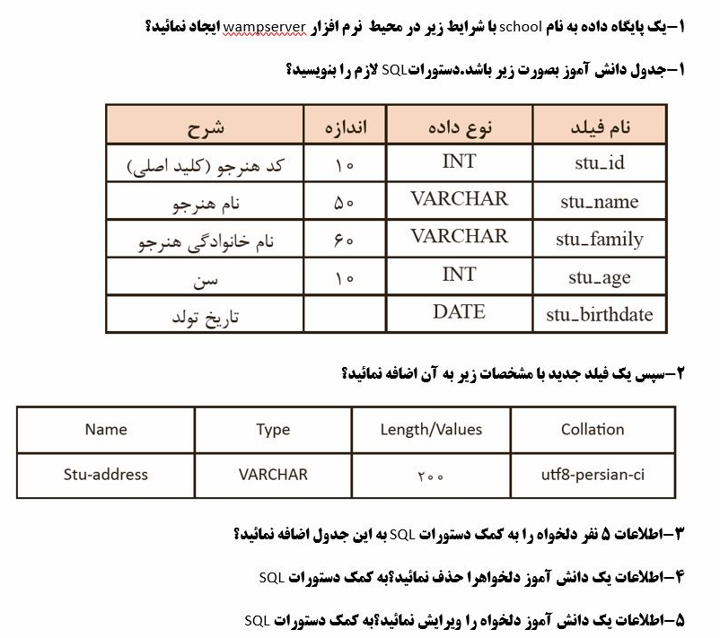

# First MySQLi PHP

Connect and work with **MySQL/MariaDB** database through **MySQLi** in **PHP**.

> The above exercises are designed for students.

This is an introductory project, If you need a simple and straightforward example that takes you straight to the point, you can check out these examples.

This is also suitable for people who forget to work with mysqli class.

## Table structure

## Features

- Create table, add new field, set Indexs
- Insert
- Delete
- Select rows
- Select single
- Edit/Update

## Pages
- Index (List table, Insert a new row)
- Edit
- Delete

© Copyright 2021, Max Base
